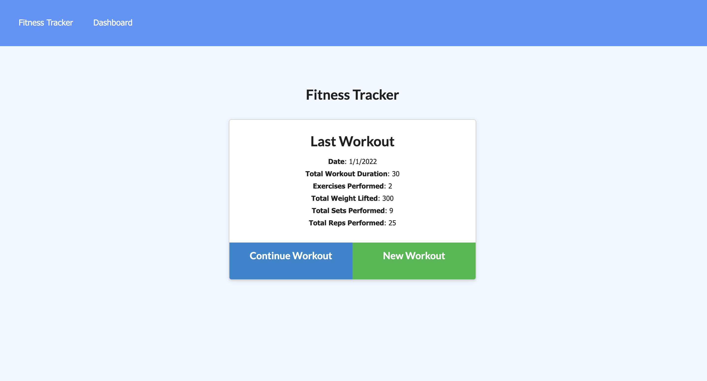
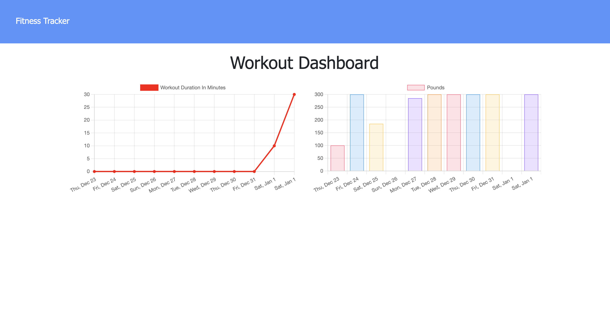

### Name of the Project: Workout-Tracker ###

### Description: ###
Workout tracker is a web applicaton that tracks fitness goals of a user.

### Motivation: ###
The motivation behind this project is to learn and demonstrate MongoDB, NodeJS, ExpressJS, Heroku, HTML, CSS, Javascript, Bootstrap and jquery(Third party API's) coding skills.

### Technologies used: ###
    * MongoDB
    * NodeJS
    * ExpressJS
    * Heroku
    * HTML
    * CSS
    * Visual Studio Code Editor
    * Javascript

### Website Screen Shots: ###

### Website Contents: ###
This application allows to view, create and track daily workouts.And able to log multiple exercises in a workout on a given day. Itr tracks the name, type, weight, sets, reps, and duration of exercise.

Live deployed link: 

## Username:
https://fitness-tracker-sk-18.herokuapp.com/?id=61d1504e3dc67a0016e17d83

https://github.com/sarasuni

## Email:

Sarasuni2021@gmail.com
